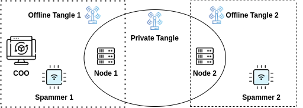
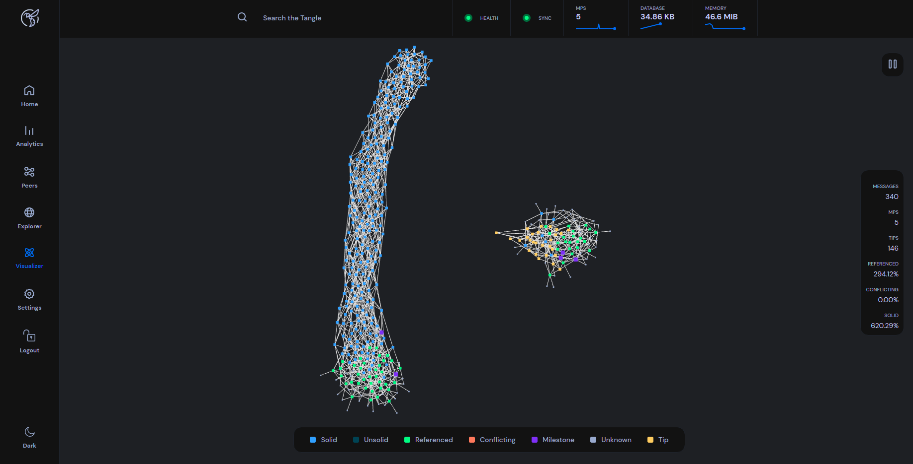
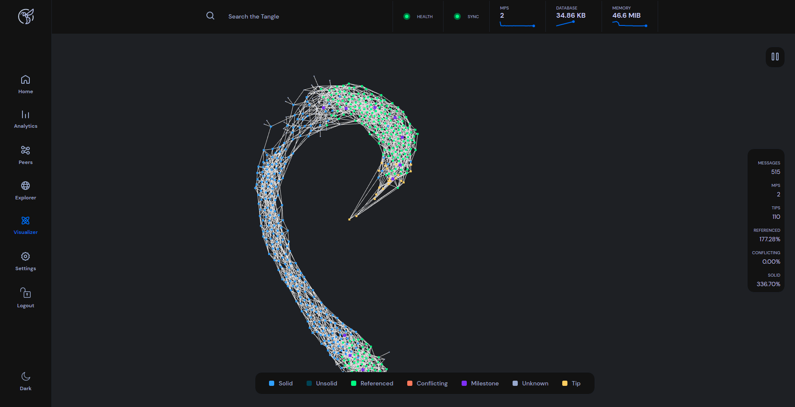

# Instruction manual for the research paper - "Offline Scaling of IoT Devices in IOTA Blockchain"

This private tangle orchestrates the following setup:



1. There are 2 spammers which are isolated from one another and can not be reached directly. Spammer1 is part of the hornet-private-net_tangle1 and Spammer2 is part of the hornet-private-net_tangle2.

2. Similarly there are two nodes that are part of the two isolated networks as well as they share one other network i.e. private_tangle.

3. The Coordinator (COO) node is a part of the hornet-private-net_tangle1 network and is peered with Spammer1 and Node1. The Coordinator node can not reach Node2 and Spammer2 directly.

Any transaction done by Spammer2 should attain finality using Node2 -> Node1 -> COO.

## Running the experiment

Inside the **hornet-private-net** directory run the command `$ ./private-tangle.sh install`. Doing this should install and run docker containers consisting of the different IOTA network nodes, such as The Coordinator, Spammer, and simple Nodes. To interact with the different nodes, the IOTA dashboard visualizer can be accessed easily on some predefined ports given below:

`Node1 8081`

`Node2 8085`

`Spammer1 8083`

`Spammer2 8084`

To access the IOTA dashboard visualizer use `127.0.0.1:<port_number>` in your web browser. For example - `127.0.0.1:8081` 

> Please make sure these ports are not currently in use by any other services.

### Running Tangle Splitting Scenario

In the tangle splitting use case, the tangle is virtually split, i.e. a significant number of transactions would still require reattachment. Under Node1 configuration, attribute `tipsel` -> `belowMaxDepth` is set to 10, i.e. any incoming transaction with milestone number below 10 in comparison to the current milestone number count on the receiving node will not be considered for the tipselection process. The default value in the public hornet is 15. On the Coordinator side, in our use case it generates the milestones every 6 seconds, we use `coordinator` -> `interval` attribute to modify this value. The default value in the public Coordinator node is 10s.

After the private network is up and running, go to the visualizer inside the IOTA Node2. Now, disconnect the Node1 from **private_tangle** network using the following command:

```bash
$ docker network disconnect private_tangle Node1
```

and after 60 seconds, run the following command:

```bash
$ docker network connect private_tangle Node1
```

Now after a few seconds, you will see a split in the tangle as shown in the following picture:



Logically this picture can be understood as the newly split tangle is referring to an old milestone that confirms a transaction in the stale tangle shown on the left. The transactions done while the tangle was offline are now lost or will not attain finality and will require reattachment. So the whole offline aspect of the continuous ledger is lost.

### Running Transactions Unreachable Scenario

Follow the steps mentioned in the previous scenario, expect this, time just run the following command well before 60 seconds, for example, 40 seconds:


```bash
$ docker network connect private_tangle Node1
```


In this case, the following visualization will be observed:



As seen in the picture, there is no split in the tangle but still, a significant number of transactions have not attained finality. In conclusion, even within the time bounds of the offline tangle synchronization, a number of transactions will still be at a high risk of not attaining finality and will require reattachment.